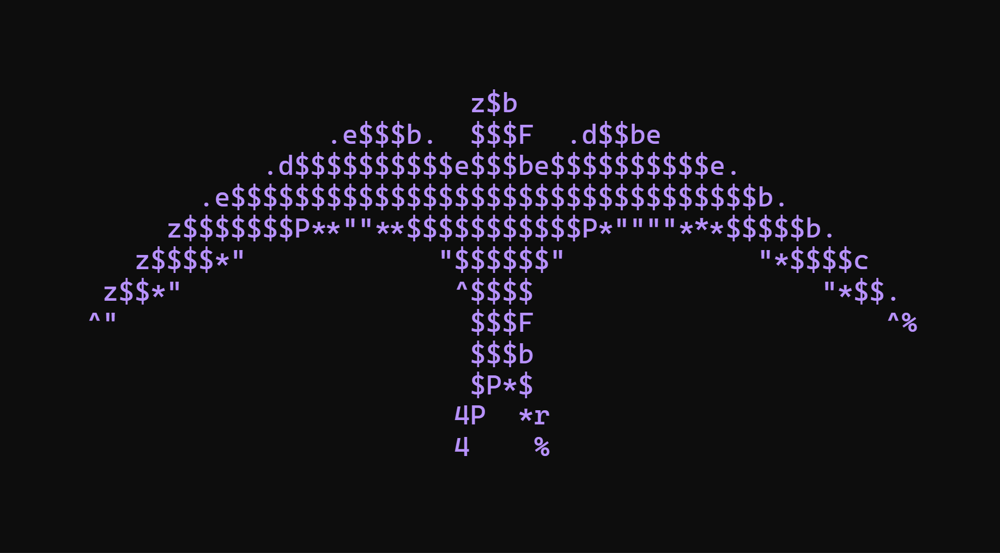

<h2 align="center">EAGLE</h2>

<div align="center">

<table>
  <tr>
    <td width="70%" valign="top">
      <h3>Photo EXIF & GPS Location Extraction Utility</h3>
      <blockquote>
        An OSINT and digital forensics utility that rips open raw image headers, extracts deep EXIF metadata, camera hardware specs, and precise GPS coordinates, reverse-geocodes the location, and outputs structured intelligence to the terminal, JSON, or an interactive web map.
      </blockquote>
      <p>
        
        
        
        
      </p>
    </td>
    <td width="30%" align="center" valign="middle">
      
    </td>
  </tr>
</table>

</div>

---

<p align="center">
  
</p>

---

<h3 align="center">Command-Line Interface</h3>

<p align="justify">
Eagle is distributed on PyPI as <code>eagle-x</code> and exposes the terminal command <code>eagle</code>. Install the package directly using pip, then analyze any image on your local filesystem with <code>eagle hunt photo.jpg</code>. For automation and OSINT pipelines, stream pure structured JSON output using <code>eagle hunt photo.jpg --json</code>, or perform reverse geocoding via <code>eagle hunt photo.jpg --geocode</code>.
</p>

<h4 align="center">Windows (PowerShell / Command Prompt)</h4>

```powershell
# Install from PyPI
pip install eagle-x

# Launch the purple flight manual
eagle

# Hunt down metadata & GPS telemetry
eagle hunt photo.jpg
eagle hunt "C:\Users\YourName\Pictures\photo.jpg"

# Reverse-geocode coordinates to street address
eagle hunt photo.jpg --geocode

# Output clean JSON to stdout
eagle hunt photo.jpg --json

# Upgrade to latest version
pip install --upgrade eagle-x
```

<h4 align="center">macOS / Linux (Terminal)</h4>

```bash
# Install from PyPI
pip3 install eagle-x

# Launch the purple flight manual
eagle

# Hunt down metadata & GPS telemetry
eagle hunt photo.jpg
eagle hunt ~/Pictures/photo.jpg

# Reverse-geocode coordinates to street address
eagle hunt photo.jpg --geocode

# Output clean JSON to stdout
eagle hunt photo.jpg --json

# Upgrade to latest version
pip3 install --upgrade eagle-x
```

---

<h3 align="center">Privacy & Security</h3>

<p align="justify">
Eagle analysis is 100% local by default. No image data or metadata is ever uploaded or transmitted over the network unless <code>--geocode</code> is explicitly passed to query OpenStreetMap Nominatim. Input images exceeding 100 Megapixels are rejected to protect against decompression bomb attacks, and binary tags are sanitized to prevent crashes.
</p>

---

<h3 align="center">Supported Formats & Telemetry</h3>

<p align="justify">
Eagle supports deep header inspection across JPEG, PNG, HEIC/HEIF, TIFF, WebP, and BMP images. Extracted telemetry includes file dimensions, color mode, megapixels, camera hardware, exposure settings, GPS coordinates (Decimal & DMS), altitude, GPS timestamp, and standard raw EXIF IFD structures.
</p>

---

<h3 align="center">Python Library Usage</h3>

<p align="justify">
You can integrate Eagle directly into your Python scripts:
</p>

```python
from eagle import analyze_image_file

result = analyze_image_file("photo.jpg", geocode=False)

print(f"Camera: {result.camera_info.make} {result.camera_info.model}")
if result.has_gps:
    print(f"Coordinates: {result.latitude}, {result.longitude}")
```

---

<h2 align="center">If you want GUI</h2>

<h3 align="center">Setup Backend</h3>

<p align="justify">
Pop open a terminal, hop into the <code>backend</code> directory with <code>cd backend</code>, and create an isolated virtual environment:
</p>

<h4 align="center">Windows (PowerShell)</h4>

```powershell
cd backend
python -m venv .venv
.venv\Scripts\Activate.ps1
pip install -r requirements.txt
uvicorn app.main:app --reload --port 8000
```

<h4 align="center">macOS / Linux (Terminal)</h4>

```bash
cd backend
python3 -m venv .venv
source .venv/bin/activate
pip install -r requirements.txt
uvicorn app.main:app --reload --port 8000
```

<p align="justify">
Your backend is now listening at <code>http://localhost:8000</code>, and you can inspect the interactive Swagger docs at <code>http://localhost:8000/docs</code>.
</p>

---

<h3 align="center">Setup Frontend</h3>

<p align="justify">
In a second terminal window, head over to the frontend with <code>cd frontend</code> and install the necessary dependencies using <code>npm install</code>. Once that's done, fire up the Vite dev server with <code>npm run dev</code>, open <code>http://localhost:5173</code> in your browser, drag and drop an image in, and you're good to go.
</p>

<h4 align="center">Windows / macOS / Linux</h4>

```bash
cd frontend
npm install
npm run dev
```

---

<p align="center">
This project is open-source and available under the <a href="LICENSE">MIT License</a>.
</p>